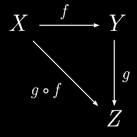

# Map

We are familiar with the `Array.prototype.map(transform)` function.

It's purpose is to transform data.

- The original array is not modified
- The new array is ALWAYS the same length as the original array
- The order of the original array is preserved in the new array

```js
const array = ["apple", "banana", "carrot", "date", "eggplant"];
const result = array
  .map(str => str.toUpperCase())
  .map(str => str.replace(/[aeiou]/gi, ""))
  .map(str => str.split(""))
  .map(arr => arr.sort())
  .map(arr => arr[arr.length - 1]);
```

Just for clarity, lets refactor each one of these transform functions.

```js
const upper = str => str.toUpperCase();
const consonants = str => str.replace(/[aeiou]/gi, "");
const split = str => str.split("");
const sort = arr => arr.sort();
const tail = arr => arr[arr.length - 1];
```

Then we could rewrite the original code using these functions.

```js
const array = ["apple", "banana", "carrot", "date", "eggplant"];
// prettier-ignore
const result = array
  .map(upper)
  .map(consonants)
  .map(split)
  .map(sort)
  .map(tail);
```

Lets first walk through what this is doing.

| Code               | Result                                                                                                                     |
| ------------------ | -------------------------------------------------------------------------------------------------------------------------- |
| `array`            | `["apple", "banana", "carrot", "date", "eggplant"]`                                                                        |
| `.map(upper)`      | `["APPLE", "BANANA", "CARROT", "DATE", "EGGPLANT"]`                                                                        |
| `.map(consonants)` | `["PPL", "BNN", "CRRT", "DT", "GGPLNT"]`                                                                                   |
| `.map(split)`      | `[`<br>`["P","P","L"],`<br>`["B","N","N"],`<br>`["C","R","R","T"],`<br>`["D","T"],`<br>`["G","G","P","L","N","T"],`<br>`]` |
| `.map(sort)`       | `[`<br>`["L","P","P"],`<br>`["B","N","N"],`<br>`["C","R","R","T"],`<br>`["D","T"],`<br>`["G","G","L","N","P","T"],`<br>`]` |
| `.map(tail)`       | `["P","N","T","T","T"]`                                                                                                    |

The end result is that this series of transforms is finding the 'last alphabetical' consonant in each word.

- Original array contained 5 items
- `.map(upper)` - created a new array with 5 items
- `.map(consonants)` - created a new array with 5 items
- `.map(split)` - created a new array with 5 items
- `.map(sort)` - created a new array with 5 items
- `.map(tail)` - created a new array with 5 items

## Category Theory

> **Category theory** formalizes mathematical structure and its concepts in terms of a labeled directed graph called a category, whose nodes are called objects, and whose labelled directed edges are called arrows (or morphisms). A category has two basic properties: the ability to compose the arrows associatively, and the existence of an identity arrow for each object.<br>- **Wikipedia**

### Function composition



- `f` is a morphism (mapping function) that transforms an `X` into a `Y`
- `g` is a morphism that transforms a `Y` into a `Z`

Function composition is a proof stating that these transform functions are associative. In other words, we could have a mapping function that transforms `X` into `Z` simply by calling `g` after `f`.

```js
const y = f(x);
const z = g(y);
```

```js
const x2z = x => g(f(x));
const z = x2z(x);
```

Using this knowledge we could rewrite the original problem and take advantage of the associative property of the transform functions (morphisms).

```js
const lastConsonant = str => tail(sort(split(consonants(upper(str)))));

const array = ["apple", "banana", "carrot", "date", "eggplant"];
const result = array.map(lastConsonant);
```

Just like our first solution, the end result is that this series of transforms is finding the 'last alphabetical' consonant in each word.

But now we eliminated the creation of 4 arrays.

- Original array contained 5 items
- `.map(lastConsonant)` - created a new array with 5 items

Imagine if the array contained thousands of items.

# Creating a `compose` function

This is an advanced topic -- not part of this bootcamp.

We could write a `compose` function to make this a little more readable.

```js
// NOTE: You don't need to understand this code. AT ALL!
// prettier-ignore
const compose = (...fns) => fns.reduceRight((f, g) => x => g(f(x)), o => o);
```

This is an extremely dense function. But at least now you have some understanding
of the `g(f(x))` portion!

With the `compose` function we could rewrite:

```js
const lastConsonant = str => tail(sort(split(consonants(upper(str)))));
```

into:

```js
const lastConsonant = compose(tail, sort, split, consonants, upper);
//                   output ⇦⇩  ⇧⇦⇩  ⇧⇦⇩    ⇧⇦⇩        ⇧⇦⇩   ⇧⇦ input
```

The `compose` function reads from right to left (R2L), much like the associate (inline) form that it is replacing. It often feels a little awkward to have to think about the compose function reading R2L. The same function can be written reading the opposite direction and this is typically known as a `pipe` function since the data is piped from one function to the next.

```js
// NOTE: You don't need to understand this code. AT ALL!
// prettier-ignore
const pipe = (...fns) => fns.reduce((f, g) => x => g(f(x)), o => o);
```

With the `pipe` function we could rewrite `lastConsonant` as:

```js
const lastConsonant = pipe(upper, consonants, split, sort, tail);
//                 input ⇨⇧   ⇩⇨⇧        ⇩⇨⇧    ⇩⇨⇧  ⇩⇨⇧  ⇩⇨ output
```
